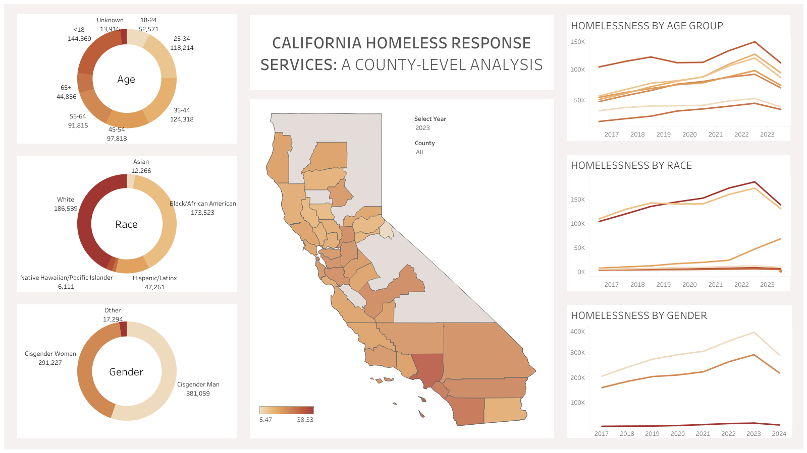

# California Homeless Response Services: a County-Level Analysis

## Overview

This project analyzes a dataset of individuals who have accessed homeless response services, examining the distribution of services across different age, race, and gender groups at the county level. An interactive Tableau dashboard was created to visualize trends and provide actionable insights for equitable resource allocation and targeted outreach.

## Project Links
- [Tableau Dashboard](https://public.tableau.com/app/profile/aliyah.good/viz/homelessness_in_california_17360271989350/HomelessnessDashboard)
- [SQL Code](./CA_homelessness_data_cleaning.sql)
  
## Dataset
- **Title:** `People Receiving Homeless Response Services by Age, Race, and Gender`
- **Source:** Homelessness Data Integration System (HDIS)
  - Available at: [data.gov](https://catalog.data.gov/dataset/people-receiving-homeless-response-services-by-age-race-ethnicity-and-gender-b667d/resource/6860eb43-14bd-4b02-8843-d5e07bb510aa)
- **Contents:**
  - Homelessness Count by:
    - Age: <code>[cy_age.csv](https://github.com/aliyahgood/portfolio/blob/main/California%20Homeless%20Response%20Services%20Analysis/data/cy_age.csv)</code>
    - Gender: <code>[cy_gender.csv](https://github.com/aliyahgood/portfolio/blob/main/California%20Homeless%20Response%20Services%20Analysis/data/cy_gender.csv)</code>
    - Race: <code>[cy_race.csv](https://github.com/aliyahgood/portfolio/blob/main/California%20Homeless%20Response%20Services%20Analysis/data/cy_race.csv)</code>

## Tools and Technologies
- **SQL:** Data cleaning and preprocessing
- **Tableau:** Data visualization and interactive dashboard creation

## Dashboard Features
- **Choropleth Map:** Visualizes the distribution of individuals receiving homeless response services by county
- **Donut Charts:** Displays demographic breakdowns by race, gender, and age
- **Line Charts:** Shows trends in the number of individuals receiving homeless response services by demographic over time 
- **Interactive Filters:**
   - **Year:** Allows users to filter data by specific years, tracking changes over time
   - **County:** Enables users to filter data by county, offering insights at a local level

For a more in-depth exploration and to interact with the data, visit the live [Tableau Dashboard](https://public.tableau.com/app/profile/aliyah.good/viz/homelessness_in_california_17360271989350/HomelessnessDashboard)

## Insights and Recommendations
- Equitable resource allocation
  - Increase funding for shelters in high-need counties, such as Los Angeles, San Francisco, and San Diego, where service demand is consistently high
  - Focus additional resources on high demand demographics, such as youth or seniors based on county distribution
- Targeted outreach
  - Implement targeted programs for growing demographics, like Hispanic/Latinx communities and youth, focusing specifically on counties where these groups are underrepresented or experiencing an increase in homelessness

## Future Improvements
To expand on this project, I would integrate a dataset on the total number of individuals experiencing homelessness in each California county. This would allow for a more comprehensive comparison between the total homeless population and those actively receiving services. With this data, I could better gauge gaps in service and improve outreach strategies, identifying counties where large portions of the homeless population are not receiving care.
