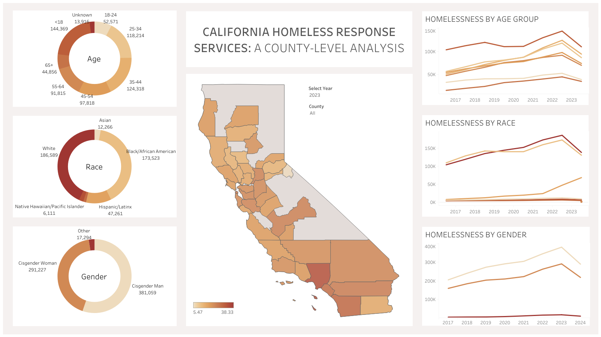

# Homelessness in California: A County-Level Analysis

## Overview

This project explores homelessness in California using demographic and county-level data. An interactive Tableau dashboard was created to identify trends and actionable insights into homelessness by race, gender, age, and location.

## Project Links:
- [Tableau Dashboard](https://public.tableau.com/app/profile/aliyah.good/viz/homelessness_in_california/HomelessnessDashboard?publish=yes/)
- [SQL Code](./CA_homelessness_data_cleaning.sql)
  
## Dataset
- **Title:** `People Receiving Homeless Response Services by Age, Race, and Gender`
- **Source:** Homelessness Data Integration System (HDIS)
  - Available at: [data.gov](https://catalog.data.gov/dataset/people-receiving-homeless-response-services-by-age-race-ethnicity-and-gender-b667d/resource/6860eb43-14bd-4b02-8843-d5e07bb510aa)
- **Contents:**
  - Homelessness Count by:
    - Age: `cy_age.csv`
    - Gender: `cy_gender.csv`
    - Race: `cy_race.csv`
 
## Tools and Technologies
- **SQL:** Data cleaning and preprocessing
- **Tableau:** Data visualization and dashboard creation

## Dashboard Features
- **Choropleth Map:** Homeless counts by county
- **Donut Charts:** Demographic breakdowns by race, gender, and age
- **Line Charts:** Trends in homelessness by demographic
- **Interactive Filters:**
   - **Year:** Allow users to filter the data by specific years to track changes over time
   - **County:** Enables users to focus on individual counties, offering detailed insights at the local level

For a more in-depth exploration and to interact with the data, visit the live [Tableau Dashboard](https://public.tableau.com/app/profile/aliyah.good/viz/homelessness_in_california/HomelessnessDashboard?publish=yes/)

## Insights and Recommendations
- Geographic Trends
  - Increase funding for shelters in high-need counties
- Demographic Disparities
  - Implement targeted programs for vulnerable demographics, such as women and seniors.
- Address systemic inequities through affordable housing initiatives and equity-focused policies.

## Challenges and Future Improvements

