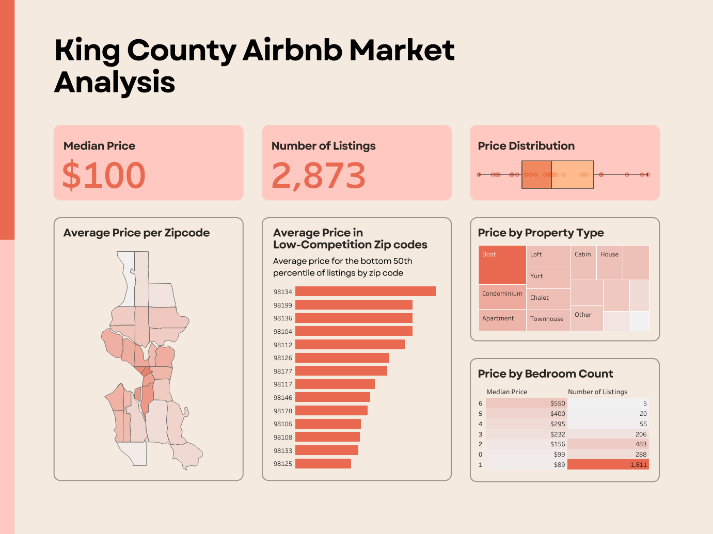

# King County Airbnb Market Analysis

## Overview

This project analyzes a dataset of Airbnb listings in King County. 

## Project Links
- [Tableau Dashboard](https://public.tableau.com/app/profile/aliyah.good/viz/AirBNBSalesAnalysis/Dashboard3)
  
## Dataset
- **Title:** ``
- **Source:**
- **Contents:**

## Tools and Technologies
- **Tableau:** Data visualization and interactive dashboard creation

## Dashboard Features
- **Choropleth Map:** 
- **Line Charts:** Shows trends in the number of individuals receiving homeless response services by demographic over time 
- **Interactive Filters:**
   - **Year:** Allows users to filter data by specific years, tracking changes over time
   - **County:** Enables users to filter data by county, offering insights at a local level

For a more in-depth exploration and to interact with the data, visit the live [Tableau Dashboard](https://public.tableau.com/app/profile/aliyah.good/viz/AirBNBSalesAnalysis/Dashboard3)

## Insights and Recommendations

## Future Improvements
To expand on this project, I would look more into market demand dynamics and include this alongside competition to give more informed advice on where one should invest for maximum profit. 
